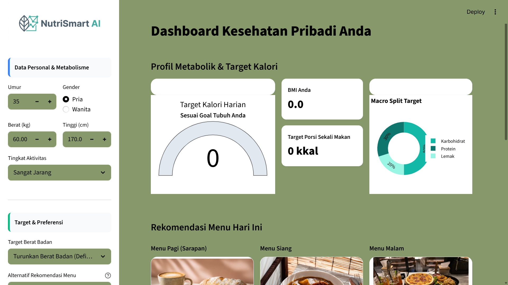

# NutriSmart AI - Premium Health Dashboard

NutriSmart AI adalah aplikasi asisten kesehatan personal berbasis web yang mengintegrasikan kalkulasi medis standar gizi dengan algoritma kecerdasan buatan untuk menyediakan rekomendasi menu makanan yang terpersonalisasi secara instan dan aman.

## 🛠️ Arsitektur & Logika Sistem

Aplikasi ini bekerja dengan menggabungkan dua pilar utama:

1. **Pilar Medis:**  
   Menggunakan parameter biometrik pengguna (Usia, Berat Badan, Tinggi Badan, Jenis Kelamin, dan Aktivitas) untuk menghitung nilai BMR dan TDEE berdasarkan **Persamaan Harris-Benedict**.

2. **Pilar AI (Machine Learning):**  
   Menggunakan algoritma **K-Nearest Neighbors (KNN)** dengan konstanta `K=3` untuk memindai basis data resep dan menarik 3 menu makanan terdekat yang nilai kalorinya paling identik dengan target kebutuhan pengguna menggunakan perhitungan *Euclidean Distance*.

---

## 📁 Struktur Repositori

```text
NUTRISMART_APP/
│
├── dashboard.png              # Tampilan utama dashboard aplikasi
│
├── data/
│   ├── final_recipes.csv      # Basis data resep utama
│   ├── logo.png               # Aset logo aplikasi
│   ├── makananpagi.jpg        # Aset gambar UI
│   ├── makanansiang.jpg       # Aset gambar UI
│   └── makananmalam.jpg       # Aset gambar UI
│
├── models/
│   └── knn_model.pkl          # Model AI KNN terlatih
│
├── app.py                     # File utama aplikasi Streamlit
├── ai_logic.py                # Modul fungsi KNN
├── clean_data.py              # Skrip preprocessing data
├── audit_data.py              # Skrip audit kualitas data
└── README.md                  # Dokumentasi proyek
Catatan Pengembangan

File dataset mentah berskala besar (RAW_recipes.csv) dan folder lingkungan virtual (venv) sengaja tidak dimasukkan ke repositori untuk mengoptimalkan ukuran penyimpanan. Aplikasi dijalankan menggunakan model hasil ekspor .pkl dan dataset ringkas final_recipes.csv.

⚙️ Fitur Utama Aplikasi
🔹 Smart Input Sidebar

Panel interaktif untuk memasukkan data fisik dan preferensi pengguna.

🔹 Automated Allergen Filter

Penyaringan bahan makanan berbahaya secara dinamis menggunakan metode string matching.

🔹 Dynamic Data Visuals

Visualisasi pembagian makronutrisi (Karbohidrat, Protein, Lemak) secara real-time menggunakan Plotly.

🔹 Personalized Recipe Cards

Kartu rekomendasi resep adaptif lengkap dengan langkah memasak otomatis menggunakan parsing aman ast.literal_eval.

🚀 Panduan Instalasi Lokal
1. Clone atau Ekstrak Repositori

Pastikan seluruh struktur folder berada di direktori kerja Anda.

2. Buat Virtual Environment
python -m venv venv
3. Aktifkan Virtual Environment
Windows (PowerShell)
.\venv\Scripts\Activate.ps1
Linux / macOS
source venv/bin/activate
4. Instal Dependensi
pip install streamlit pandas scikit-learn plotly matplotlib seaborn
5. Jalankan Aplikasi
streamlit run app.py
👥 Anggota Kelompok 5
Tegar Madya Shafwan (241712002)
Anggota Kelompok (241712010)
Anggota Kelompok (241712012)
Reza Pahlepi (241712013)
Ruth Angel Sihombing (241712014)
