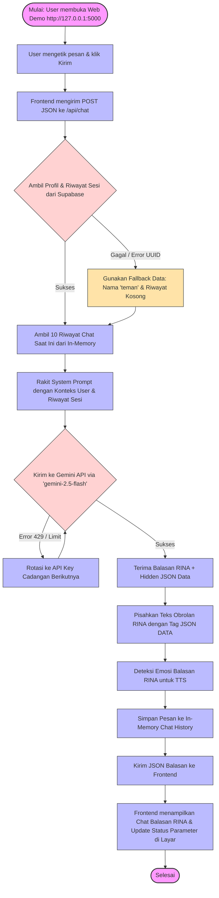

# 📊 Prompt untuk Membuat Flowchart RINA Chatbot

File ini berisi **Prompt AI** yang bisa langsung kamu salin (copy-paste) ke **ChatGPT, Claude, atau DeepSeek** untuk membuat diagram/flowchart alur kerja RINA Chatbot dengan sangat mudah. 

Selain itu, di bagian bawah juga sudah saya sediakan **kode Mermaid.js** siap pakai jika kamu ingin langsung melihat visualisasinya di [Mermaid Live Editor](https://mermaid.live).

---

## 💬 Prompt untuk ChatGPT / Claude
*Salin seluruh teks di bawah kotak ini dan tempelkan ke AI pilihanmu:*

```text
Halo! Saya sedang mengerjakan Proyek Akhir kuliah D3 Teknik Informatika mengenai Chatbot AI bernama RINA (LifeLens AI Companion). 
Saya butuh dibuatkan flowchart alur kerja sistem (System Workflow) yang mendetail untuk dokumentasi bab 3/4 Tugas Akhir saya. 

Tolong buatkan deskripsi flowchart langkah demi langkah beserta kode diagram visualnya (bisa berupa Mermaid.js atau petunjuk terstruktur) berdasarkan alur kerja sistem berikut:

1. MULAI: User membuka halaman chat web demo di browser (http://127.0.0.1:5000).
2. INPUT: User mengetik pesan (misal: "halo, aku cape banget begadang terus") lalu klik Kirim.
3. FRONTEND REQUEST: Frontend mengirimkan payload berupa JSON {"message": text, "user_id": user_id} ke endpoint Flask "/api/chat" menggunakan metode POST.
4. BACKEND CONTEXT FETCH:
   - Backend Flask menerima request.
   - Backend memanggil database Supabase untuk mengambil informasi profil user dan 5 riwayat sesi terakhir.
   - PENGAMANAN (Error Handling): Jika user_id bukan format UUID atau koneksi database error, sistem otomatis beralih ke mode "Fallback" menggunakan nama default ("teman") dan riwayat kosong agar server tidak crash.
5. SESSION MEMORY (IN-MEMORY HISTORY):
   - Backend mengambil 10 pesan percakapan terakhir yang disimpan di memori RAM server (in-memory deque) agar RINA mengingat konteks obrolan saat ini.
6. SYSTEM PROMPT ASSEMBLER:
   - Backend menggabungkan Persona RINA (hangat, tidak membeo, empati), Konteks dari Database, Tingkat Stres User (LOW/MEDIUM/HIGH), dan Riwayat Sesi Saat Ini menjadi satu System Prompt yang utuh.
7. GEMINI API CONNECTION (MULTI-KEY ROTATION):
   - Backend mengirimkan System Prompt + Pesan User ke Google Gemini API menggunakan model "gemini-2.5-flash".
   - PENGAMANAN (Key Rotation): Jika API Key aktif terkena limit (Error 429) atau error lainnya, sistem otomatis melakukan rotasi ke kunci cadangan selanjutnya (GEMINI_API_KEY_1 sampai GEMINI_API_KEY_5) hingga berhasil.
8. GEMINI RESPONSE & HIDDEN DATA:
   - Gemini mengembalikan balasan chat RINA beserta ekstraksi parameter burnout tersembunyi berformat JSON dalam tag khusus [DATA:...:DATA].
9. RESPONSE PARSING & CLEANING:
   - Backend memisahkan teks obrolan RINA dengan data JSON tersembunyi.
   - Backend menjalankan fungsi deteksi emosi pada teks balasan RINA (Concerned/Encouraging/Happy/Neutral) untuk keperluan Text-to-Speech (TTS).
10. MEMORY UPDATE & FRONTEND RESPONSE:
    - Backend menyimpan pesan User dan balasan RINA ke dalam riwayat in-memory.
    - Backend mengirimkan data JSON {"rina": clean_text, "data": extracted_data} kembali ke frontend sebagai HTTP Response 200 OK.
11. DISPLAY & SELESAI: Frontend menampilkan balon chat balasan RINA dan memperbarui panel ekstraksi data (Sleep, Mood, Workload) di layar secara real-time.

Tolong buatkan penjelasan flowchart yang rapi, profesional, dan gunakan standar penulisan Tugas Akhir Informatika. Berikan juga kode diagram Mermaid.js agar saya bisa langsung merendernya secara visual. Terima kasih!
```

---

## 🛠️ Kode Mermaid.js Siap Pakai
Jika kamu ingin merender flowchart ini secara langsung, salin kode di bawah ini dan tempelkan ke situs **[mermaid.live](https://mermaid.live)**:



---

> [!NOTE]
> File ini dibuat di folder proyek utama dengan nama `flowchart_prompt.md` sehingga aman dan tidak menimpa dokumentasi persona RINA (`prompt.md`) yang sudah kamu buat sebelumnya. 
